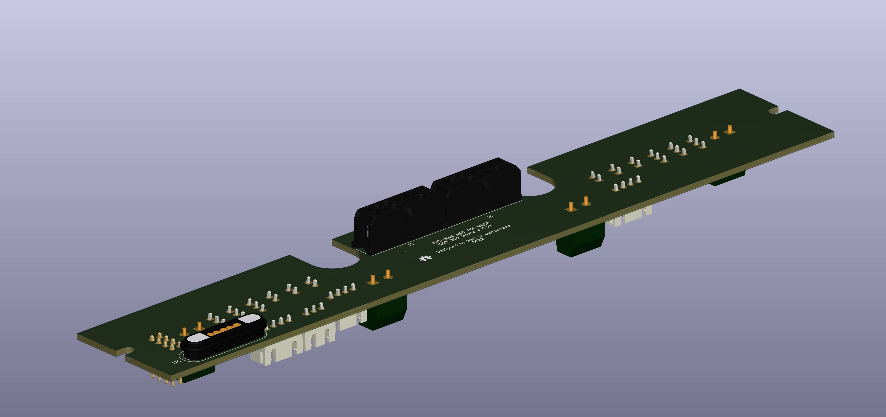
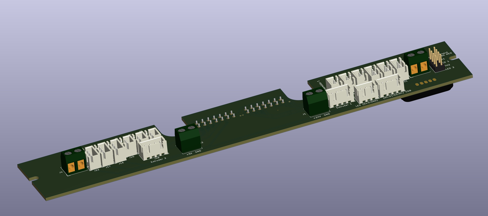

# Wasp-Topdeck-PCB

This is the pcb to simplyfy the wireing for the WASP IDEX 3d printer

The printer is a variation of the Double Dragon from zrancho

Connectors are common JST, Molex and Terminals with the exception
of a 5 pin magnetic connector for wirening the tophead USB cam and LED's

The connector can be sourced from Aliexpress here https://www.aliexpress.com/item/1005003238190621.html
